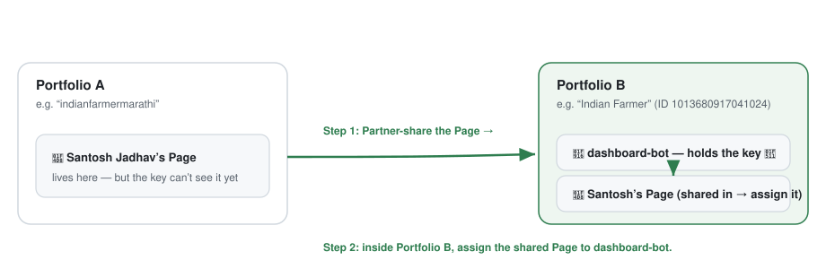

# Step 6 — A Page in another portfolio 📁➡️📁

Sometimes the Page you want is in a **different business portfolio** (a different
folder at Meta). Your robot (`dashboard-bot`) lives in **one** folder and can only
see Pages in **that** folder. So we do a two-part move.

> 🧠 **Real example from this project:** the *Santosh Jadhav* Page lived in a folder
> called **indianfarmermarathi**, but `dashboard-bot` lives in **Indian Farmer**. So
> the robot couldn't see it. Here's how we fixed it.

---

## The rule

> A System User can only be given Pages that are in **its own** portfolio.
> To use a Page from another portfolio, **share it into** the robot's portfolio first.

So there are **two** parts:

- **Part 1** — Share the Page *from* its home folder *to* the robot's folder.
- **Part 2** — Now that it's in the robot's folder, **assign** it to the robot.

---

## Part 1 — Share the Page across (do this in the Page's *home* portfolio)

1. Go to **https://business.facebook.com**.
2. Top-left **portfolio switcher** → choose the folder that **owns** the Page
   (e.g. **indianfarmermarathi**).
3. **Settings → Business Settings** → **Users → Partners** (in some layouts it's a
   top-level **Partners**).
4. Click **Add** → choose **"Give a partner access to your assets"** (you are
   *sharing your* asset, not asking for one).
5. Enter the **Business ID of the folder your robot lives in**. For this project that
   is **Indian Farmer**, ID **`1013680917041024`**.
6. Choose **Pages** → tick the Page → give **Full control**.
7. Also share **Instagram accounts** → tick the linked Instagram → Full control.
8. Confirm. You'll see **"Assets assigned."** ✅

> 🧾 **Where do I find a Business ID?** Business Settings → **Business info** shows the
> ID for the folder you're in. You need the **receiving** folder's ID (the robot's
> folder) when sharing.

---

## Part 2 — Assign the shared Page to the robot (in the robot's portfolio)

1. Top-left **portfolio switcher** → switch to the robot's folder (**Indian Farmer**).
2. **Business Settings → Users → System users → `dashboard-bot` → Add assets**.
3. **Facebook Pages** → the shared Page **now appears here** → tick it → **Full
   control** → **Assign assets**.
4. **Instagram accounts** → tick its Instagram → Full control → Save.

> ⚠️ **Don't stop after Part 1!** Sharing lets the *folder* see the Page. The *robot*
> still needs Part 2 (the assign step), or the dashboard menu will stay empty.

---

## Check it worked

Open the dashboard → hard-refresh (**Shift** + reload) → **Facebook** tab → open the
**Page / creator** menu. The newly shared Page should now be in the list. Pick it →
**Fetch comments**. 🎉

---

## If Part 1 is blocked

If Meta asks you to do **Business Verification** before sharing, you have two choices:

- Finish the verification Meta asks for (it can take a little while), **or**
- Use the **"Use my own token"** box in the dashboard: make a separate key inside that
  other portfolio (repeat [Step 2](02-system-user-and-token.md) there) and paste it
  in the dashboard at fetch time. It works, but that Page won't get the automatic
  nightly refresh.

**Back to:** [Step 5 — Pick which Page to read](05-choose-which-page.md) ·
**Trouble?** → [Troubleshooting](07-troubleshooting.md)
