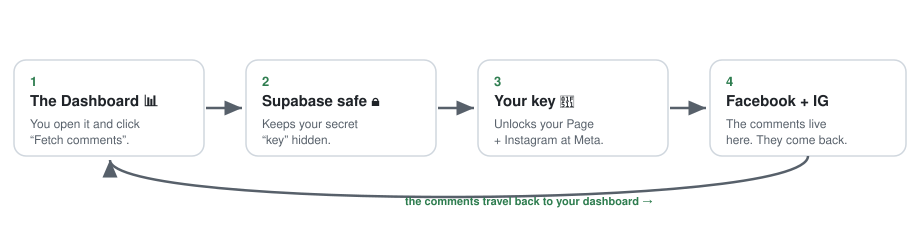

# Connect Facebook & Instagram — the easy guide 📘📸

This guide shows you how to let the dashboard read the comments on your **Facebook
Page** and your **Instagram** account.

We wrote it so that **anyone** can follow it — no coding, no computer wizard needed.
Read slowly, do one step at a time, and you will get there. 🙂

---

## First, the big idea (in one picture)

To read your comments, the dashboard needs a special **key** (grown-ups call it a
"token"). This guide helps you **make that key** and **plug it in**. After that, you
just click a button and comments appear.

**Say it like a story:**

1. You open the **Dashboard** and click *Fetch comments*.
2. The dashboard asks the **Supabase safe**, which keeps your secret **key** hidden.
3. The **key** unlocks your Facebook Page and Instagram over at Meta.
4. The **comments** come back and show up in the dashboard. 🎉

You only build the key **once**. After that it keeps working (the key never expires).

---

## Words you will see (tiny dictionary)

| Word | What it really means |
|---|---|
| **Page** | Your Facebook Page (not your personal profile — the *Page* people follow). |
| **Instagram Business account** | An Instagram account that is linked to a Facebook Page. |
| **App** | A little robot helper you create at Meta that is *allowed* to read your Page. |
| **System User** | A robot employee that never sleeps and **holds the key**. We call ours `dashboard-bot`. |
| **Token / key 🔑** | A long secret password that says "this app may read this Page." |
| **Business portfolio** | A folder at Meta that holds some Pages, apps, and people. You can have more than one. |
| **Supabase secret 🔒** | A safe hiding spot on our server where the key is stored. The key never goes to your browser. |

---

## Which situation are you in? (pick your path)

> 🧭 **Not sure? Start at the top and go down.** Each page is short.

- 🟢 **"I'm setting up Facebook/Instagram for the very first time."**
  Do these in order:
  1. [Make the Meta app](01-create-app.md)
  2. [Make the System User and the key](02-system-user-and-token.md)
  3. [Put the key into Supabase](03-add-secrets-to-supabase.md)
  4. [Check the key is good](04-check-your-token.md)
  5. [Pick which Page to read](05-choose-which-page.md)

- 🟡 **"I already set it up, but I want to read a *different* Page I own."**
  → [Pick which Page to read](05-choose-which-page.md)

- 🟠 **"The other Page is in a *different* business portfolio."**
  → [A Page in another portfolio](06-a-page-in-another-portfolio.md), then
  [Pick which Page to read](05-choose-which-page.md)

- 🔴 **"Something is broken / I see a red error."**
  → [Troubleshooting](07-troubleshooting.md)

---

## Handy links (bookmark these)

| Where | Link |
|---|---|
| Make/see your apps | https://developers.facebook.com |
| Business settings (Pages, System Users) | https://business.facebook.com |
| Check a key is valid | https://developers.facebook.com/tools/debug/accesstoken/ |
| Put the key in Supabase | https://supabase.com/dashboard/project/aycfiqndcavzgipgurih/settings/functions |
| The dashboard itself | https://digitalpritam1.github.io/youtube-comment-dashboard/ |

---

## Two safety rules (please read)

1. **Never paste your key into a chat, an email, or any website except Meta's own
   Debugger and the Supabase secret box.** The key is like a house key — anyone who
   has it can read your Page.
2. If your key ever shows up in a screenshot or a message, **make a new one** (the
   [token page](02-system-user-and-token.md) has a *Revoke tokens* button) so the
   old one stops working.

---

*This folder is the whole guide. Every page links to the next one, so you never
have to guess what to do.*
